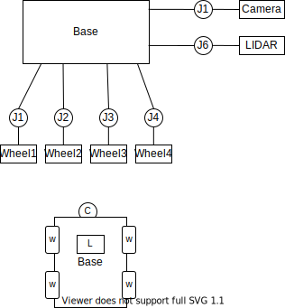
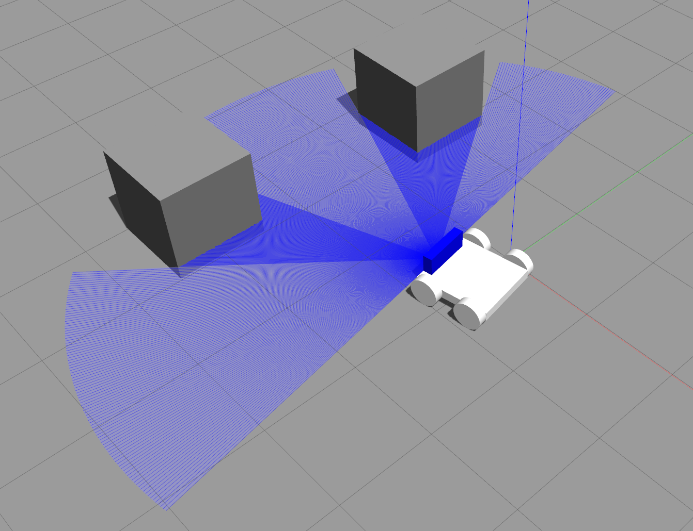

# Custom Robot Creation for ROS Projects

## ROS project workflow

- Create a robot with help of URDF
- Define the joint axis. Joint axes are the parts which are moving in the robot that are not fixed.
- Plugins addtion to start the taking information inside of robot
- Simulation settings for the environment of the robot
- Writing algorithms in the environment
  


## Create a package

Create rover package and some folder for simulation

```sh
mkdir -p ~/ws/src
ros2 pkg create rover --build-type ament_python --dependencies rclpy
mkdir -p ~/ws/src/rover/launch
mkdir -p ~/ws/src/rover/urdf
```

Add the created folder under setup.py

```py
    data_files=[
        ('share/ament_index/resource_index/packages',
            ['resource/' + package_name]),
        ('share/' + package_name, ['package.xml']),
        (os.path.join('share', package_name), glob('launch/*.py')),
        (os.path.join('share', package_name), glob('worlds/*')),
        (os.path.join('share', package_name), glob('urdf/*')),
        (os.path.join('lib', package_name), glob('scripts/*')),
    ],
```

## URDF of a Robot

- URDF-Tree contains links and joints.
- Joint types: fixed, revolute, continuous
- All of the links have a specific relation with the other links
- Install the ROS extension on VS Code
- ctrl + shift + p = ROS: Preview URDF shows the robot

    

```sh
colcon build --packages-select rover
ros2 launch rover rviz_launch.py 
ros2 launch rover gazebo_launch.py
```

## Launch files

Install robot and joint state publishers

```sh
sudo apt-get install ros-foxy-robot-state-publisher
sudo apt-get install ros-foxy-joint-state-publisher
```

Launch script for rviz
```py
import os
from ament_index_python.packages import get_package_share_directory
from launch import LaunchDescription
from launch_ros.actions import Node

def generate_launch_description():
    package_dir = get_package_share_directory('rover')
    urdf = os.path.join(get_package_share_directory('rover'),'rover.urdf')
    rviz_config_file=os.path.join(package_dir,'config.rviz')

    return LaunchDescription([
        Node(
            package='robot_state_publisher',
            executable='robot_state_publisher',
            name='robot_state_publisher',
            output='screen',
            arguments=[urdf]),
        Node(
            package='joint_state_publisher_gui',
            executable='joint_state_publisher_gui',
            name='joint_state_publisher_gui',
            arguments=[urdf]),

        Node(
        package='rviz2',
        executable='rviz2',
        name='rviz2',
        arguments=['-d',rviz_config_file],
        output='screen'),
    ])
```

Build the package and launch the rover

```sh
colcon build --packages-select rover
ros2 launch rover rviz_launch.py
```

## Gazebo for simulation

Launch file for Gazebo

```py
import os
from ament_index_python.packages import get_package_share_directory
from launch import LaunchDescription
from launch.actions import DeclareLaunchArgument, ExecuteProcess
from launch.substitutions import LaunchConfiguration
from launch_ros.actions import Node
from launch.launch_description_sources import PythonLaunchDescriptionSource

def generate_launch_description():
  urdf = os.path.join(get_package_share_directory('rover'),'rover.urdf')
  return LaunchDescription([
    #   publishes tf for links of the robot without joints
        Node(
            package='robot_state_publisher',
            executable='robot_state_publisher',
            name='robot_state_publisher',
            output='screen',
            arguments=[urdf]),
    #  To publish tf for Joints only links
        Node(
            package='joint_state_publisher',
            executable='joint_state_publisher',
            name='joint_state_publisher',
            output='screen',
            ),
#  Gazebo related stuff required to launch the robot in simulation
        ExecuteProcess(
            cmd=['gazebo', '--verbose', '-s', 'libgazebo_ros_factory.so'],
            output='screen'),
        Node(
            package='gazebo_ros',
            executable='spawn_entity.py',
            name='urdf_spawner',
            output='screen',
            arguments=["-topic", "/robot_description", "-entity", "dolly"])
  ])

```

Build the package and launch the rover

```sh
colcon build --packages-select rover
ros2 launch rover gazebo_launch.py
```



## Gazebo plugins for environment data

Extend the rover.urdf by differential drive, camera, LIDAR and test with teleoperation keyboard

```sh
ros2 run teleop_twist_keyboard teleop_twist_keyboard 
ros2 launch rover gazebo_launch.py
```